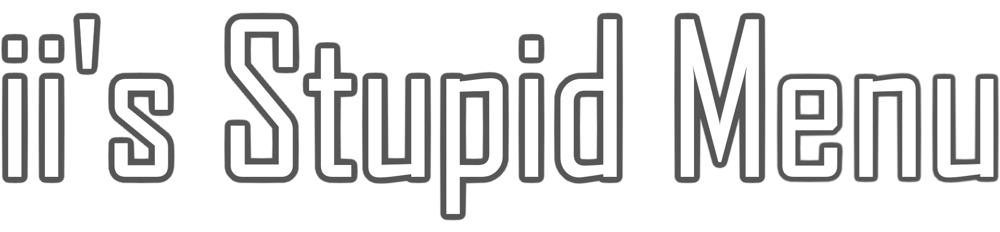
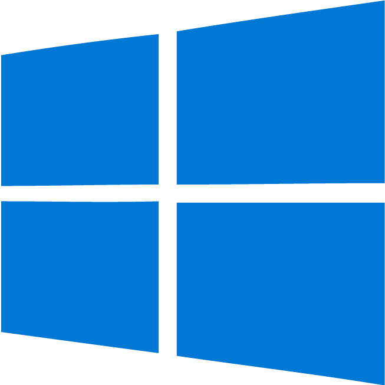
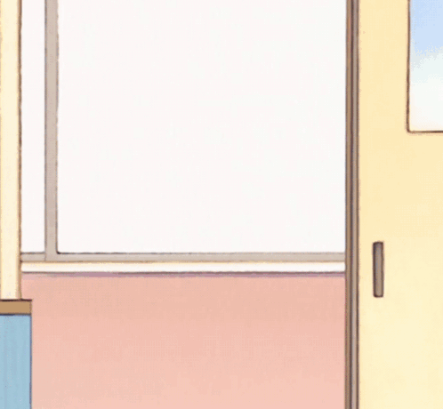

	
"Thank you guys for 2 years, it's been a pleasure <3" - iiDk

  
  

---

	
	
	

---

#  ii's Stupid Menu  

ii's Stupid Menu is a **feature-packed** mod menu for Gorilla Tag, built by [**iiDk**](https://github.com/iiDk-the-actual) and continued by [ASTRA](https://github.com/ASTRA228b), [CubicCreeper](https://github.com/CubicCreeper), [nyphrux](https://github.com/nyphrux).

Whether you just want mods, are a developer, or anything in between, this menu has you covered. Designed to be **as useful as possible**, it includes a variety of features and options that let you customize your modding experience to your heart’s content.  

> Why settle for boring when you can have *stupidly* good?  

> [!NOTE] 
> This is a LTS version of ii's Stupid Menu.
> The original is no longer recieving updates as iiDk has dropped development.
> This fork will be ran by <b>ASTRA</b>

  
<b>💡 Why open-source?</b>

	
Great question. The modding community used to be about **sharing, learning, and improving** together. But nowadays, everything’s locked behind **paywalls and obfuscation**. That’s not how it should be.  

By making this menu open-source, I'm giving **everyone** the opportunity to:  
- Learn how mod menus work 
- Experiment with new ideas  
- Contribute to the Gorilla Tag modding scene  
- ⭐ **Keep modding free and accessible**  

Let's bring back the collaboration of modding. No paywalls, no secrets, no malware, just good mods.  

  
<b>❓ Can I use your code?</b>

	
**Of course!** But there’s a catch: you gotta play fair. **[GPL-3.0 License](https://www.gnu.org/licenses/gpl-3.0.html) rules apply**, which means that if you use my code:  
- Your project **must** also be open-source.  
- Give credit where it's due.
- No shady stuff.
- **[Follow the license.](https://www.gnu.org/licenses/gpl-3.0.html)**

> "You wouldn’t steal a method." 
> [🎥 *(Or would you?)*](https://www.youtube.com/watch?v=zMBqPdMzZ9E)

  
<b>🐀 Is this mod ratted?</b>

	
No, ii's Stupid Menu (Original or not) isn't ratted. It gets detected by windows defender as its not a signed file and opens connections to websites online for data.
> The menu sends requests to https://iidk.online for telemetry, administrative, and TTS (text to speech) purposes. 
> The menu sends requests to https://text.pollinations.ai for the mod **AI Assistant**. (when enabled) 
> The menu sends requests to https://lazypy.ro for many TTS voices. 
All past accusations of ii's Stupid Menu (Original or not) of the menu being ratted are <b>NOT</b> true.

  
<b>💾 Installation</b>

	
1. **Download** the latest release **[here](https://github.com/iiDk-the-actual/iis.Stupid.Menu/releases/latest)**
2. **Drag & Drop** `iis_Stupid_Menu.dll` into your plugins folder  
3. **Launch** Gorilla Tag and enjoy!

**🧱 From Source Code (for developers!)**

1. Download the source code **[here](https://github.com/iiDk-the-actual/iis.Stupid.Menu/releases/latest)**
2. Edit `Directory.Build.props` and update `<GamePath>` if your Gorilla Tag is in a custom spot
3. Build the project with `Ctrl + Shift + B` 
✅ The DLL will automatically go into your Gorilla Tag plugins folder

---

  
<b>🎛️ System Compatibility</b>

	
| Operating System | Menu | Fonts | Images | Sounds | Videos |
|------------------|------|--------|--------|--------|--------|
| Windows 10|✅|✅|✅|✅|✅|
| Windows 11|✅|✅|✅|✅|✅|
| Mac OS|✅|✅|✅|✅|❌|
| Linux|✅|✅|✅|✅|❌|

> ✅ Works as intended ; ⚠️ Semi functional ; ❌ Does not work ; ❓ Untested

  
<b>🔗 Headset Compatibility</b>

	
| Headset | Menu | Mods |
|---------|------|------|
|Rift|✅|✅|
|Rift S|✅|✅|
|Oculus Go|⚠️|❌|
|Quest 1|✅|✅|
|Quest 2|✅|✅|
|Quest Pro|✅|✅|
|Quest 3/3s|✅|✅|
|Pico 4/Pro|✅|✅|
|Pico 4 Ultra Pro|✅|⚠️|
|Valve Index|✅|✅|
|HTC VIVE/Pro|✅|⚠️|
|HP Reverb G1/G2|✅|⚠️|

> ✅ Fully functional ; ⚠️ Limited functionality ; ❌ Not functionable ; ❓ Untested

  
<b>💖 Support</b>

	
Please do support iiDk as he deserves better after what happened.
Heres some of his links you can hop over to.

| Platform   | Link | Address |
|------------|------|---------|
| Bitcoin    |  | [bc1qtmrqtq4ag720tvux64ff3rjp632jy2d447p3nx](bitcoin:bc1qtmrqtq4ag720tvux64ff3rjp632jy2d447p3nx) |
| Ethereum   |  | [0xa1A78771422F602d9Ded0E8373d5A3D77E146877](ethereum:0xa1A78771422F602d9Ded0E8373d5A3D77E146877) |
| Litecoin   |  | [LaoNB7KADaGGb5ik8RhEBhAFdhM9pu5se5](litecoin:LaoNB7KADaGGb5ik8RhEBhAFdhM9pu5se5) |
| XRP        |  | [rpLLN1Gse5zFnVxwQkMvh6jvKKtPrAjvLV](xrp:rpLLN1Gse5zFnVxwQkMvh6jvKKtPrAjvLV) |
| Patreon    |  | [iiDk](https://www.patreon.com/iiDk) |
| CashApp    |  | [$iiWasHere](https://cash.app/$iiWasHere) |

> [!NOTE] 
> This product is not affiliated with Gorilla Tag or Another Axiom LLC and is not endorsed or otherwise sponsored by Another Axiom LLC. Portions of the materials contained herein are property of Another Axiom LLC. © 2026 Another Axiom LLC. 
> Menu sends requests to https://iidk.online for telemetry, administrative, and TTS (text to speech) purposes. 
> Menu sends requests to https://text.pollinations.ai for the mod **AI Assistant**. (when enabled) 
> Menu sends requests to https://lazypy.ro for many TTS voices. 
> Menu connects to wss://iidk.online for friend system and administrative purposes. 
> The donate, search, star and speak symbols are made by [Icons8](https://icons8.com).

> ii's Stupid Menu - README.md 
> A mod menu for Gorilla Tag with over 1000+ mods
>
> Copyright (C) 2026  Goldentrophy Software [Deprecated]
> https://github.com/iiDk-the-actual/iis.Stupid.Menu
> 
> This program is free software: you can redistribute it and/or modify
> it under the terms of the GNU General Public License as published by
> the Free Software Foundation, either version 3 of the License, or
> (at your option) any later version.
> 
> This program is distributed in the hope that it will be useful,
> but WITHOUT ANY WARRANTY; without even the implied warranty of
> MERCHANTABILITY or FITNESS FOR A PARTICULAR PURPOSE.  See the
> GNU General Public License for more details.
> 
> You should have received a copy of the GNU General Public License
> along with this program.  If not, see <https://www.gnu.org/licenses>.

Thanks for reading!

  

